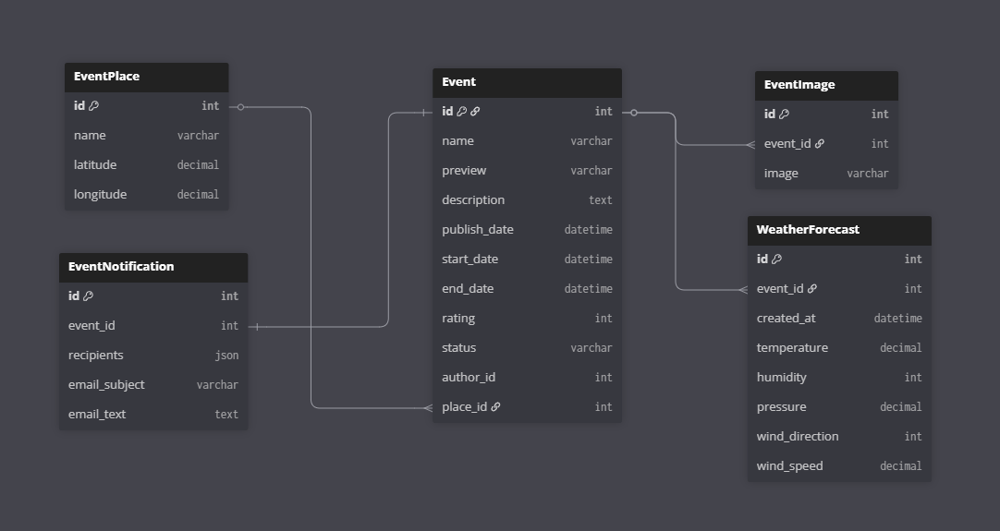

# Схема базы данных

---

---

# Таблицы

## EventPlace

Хранит места проведения мероприятий.

| Поле      | Тип          | Описание                   |
| --------- | ------------ | -------------------------- |
| id        | integer      | Primary key                |
| name      | varchar(100) | Уникальное название места |
| latitude  | decimal(9,6) | Широта                     |
| longitude | decimal(9,6) | Долгота                    |

---

## Event

Хранит информацию о мероприятиях.

| Поле         | Тип             | Описание                        |
| ------------ | --------------- | ------------------------------- |
| id           | integer         | Primary key                     |
| name         | varchar(100)    | Уникальное название мероприятия |
| preview      | image           | Превью мероприятия              |
| description  | text            | Описание мероприятия            |
| publish_date | datetime        | Дата публикации                 |
| start_date   | datetime        | Дата начала мероприятия         |
| end_date     | datetime        | Дата завершения мероприятия     |
| author_id    | FK → User       | Автор мероприятия               |
| place_id     | FK → EventPlace | Место проведения мероприятия    |
| rating       | smallint        | Рейтинг мероприятия (0-25)      |
| status       | varchar         | Текущий статус мероприятия      |

Превью создаются автоматически на основе загруженных изображений мероприятия.

Возможные статусы мероприятия:

* draft, черновик, не опубликовано
* published, опубликовано
* started, начавшееся
* ended, завершившееся
* cancelled, отмененное

---

## EventImage

Хранит изображения относящиеся к мероприятиям.

| Поле     | Тип        | Описание                     |
| -------- | ---------- | ---------------------------- |
| id       | integer    | Primary key                  |
| event_id | FK → Event | Мероприятие                  |
| image    | image      | Путь до изображения на диске |

* можно загрузить несколько изображений для одного мероприятия

---

## WeatherForecast

Хранит прогнозы погоды для актуальных мероприятий.

| Поле           | Тип        | Описание                        |
| -------------- | ---------- | ------------------------------- |
| id             | integer    | Primary key                     |
| event_id       | FK → Event | Мероприятие                     |
| created_at     | datetime   | Время создания прогноза         |
| temperature    | decimal    | Температура                     |
| humidity       | integer    | Относительная влажность (0–100) |
| pressure       | decimal    | Атмосферное давление            |
| wind_direction | integer    | Направление ветра (0-359)       |
| wind_speed     | decimal    | Скорость ветра                  |

* таблица допускает несколько прогнозов, однако старые прогнозы автоматически удаляются
* прогнозы запрашиваются только для опубликованных мероприятий, начинающихся в течение 10 дней

---

## EventNotification

Хранит настройки для уведомлений, отправляемых пользователям на email в момент публикации.

| Поле          | Тип        | Описание         |
| ------------- | ---------- | ---------------- |
| id            | integer    | Primary key      |
| event_id      | FK → Event | Мероприятие      |
| recipients    | json       | Список адресатов |
| email_subject | varchar    | Тема письма      |
| email_text    | text       | Текст письма     |

* мероприятие может иметь только одну настройку уведомления

---

# Отношения

| A        | B                 | Тип         | Описание                          |
| -------- | ----------------- | ----------- | --------------------------------- |
| Event    | User              | many-to-one | Автор мероприятия                 |
| Event    | EventPlace        | many-to-one | Место проведения мероприятия      |
| Event    | EventImage        | one-to-many | Изображения мероприятия           |
| Event    | WeatherForecast   | one-to-many | Прогноз погоды мероприятия        |
| Event    | EventNotification | one-to-one  | Настройки уведомления мероприятия |

